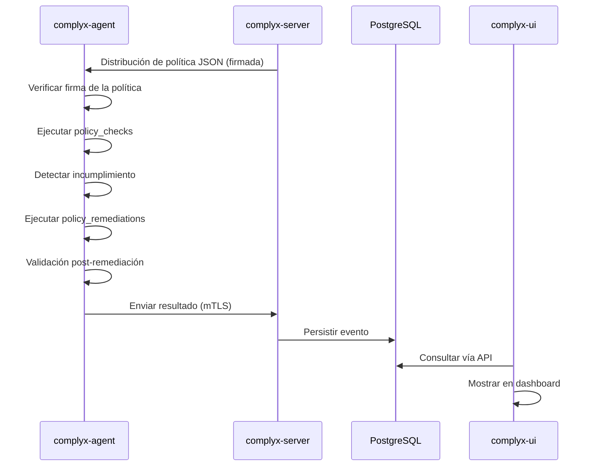
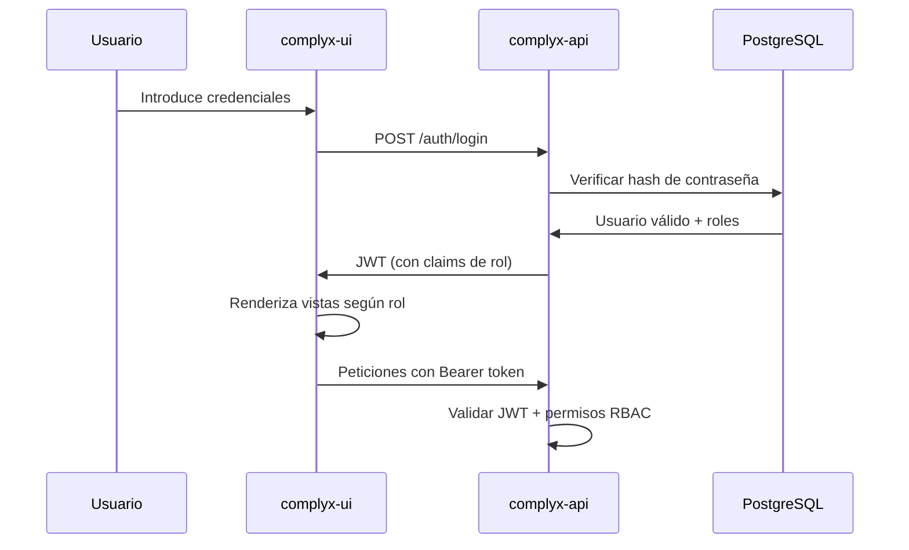

# Flujo de datos

## Ciclo de cumplimiento

```mermaid
sequenceDiagram
    participant A as complyx-agent
    participant S as complyx-server
    participant DB as PostgreSQL
    participant UI as complyx-ui

    S->>A: Distribución de política JSON (firmada)
    A->>A: Verificar firma de la política
    A->>A: Ejecutar policy_checks
    A->>A: Detectar incumplimiento
    A->>A: Ejecutar policy_remediations
    A->>A: Validación post-remediación
    A->>S: Enviar resultado (mTLS)
    S->>DB: Persistir evento
    UI->>DB: Consultar vía API
    UI->>UI: Mostrar en dashboard
```

## Flujo de autenticación de usuario

```mermaid
sequenceDiagram
    participant U as Usuario
    participant UI as complyx-ui
    participant API as complyx-api
    participant DB as PostgreSQL

    U->>UI: Introduce credenciales
    UI->>API: POST /auth/login
    API->>DB: Verificar hash de contraseña
    DB->>API: Usuario válido + roles
    API->>UI: JWT (con claims de rol)
    UI->>UI: Renderiza vistas según rol
    UI->>API: Peticiones con Bearer token
    API->>API: Validar JWT + permisos RBAC
```
