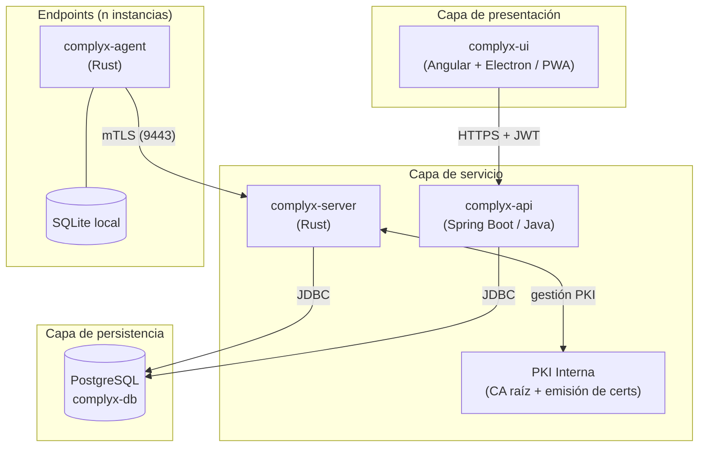

# Visión general

## Diagrama de arquitectura

## Principios de diseño

**Separación de responsabilidades**
: Cada componente tiene una única función bien definida. La UI no contiene lógica de negocio, el agente no ejecuta comandos arbitrarios y la API es la única fuente de verdad.

**Seguridad por defecto**
: Toda comunicación entre agente y servidor usa mTLS obligatorio. Los tokens JWT tienen expiración y alcance limitado.

**Resiliencia**
: El agente opera de forma autónoma ante desconexión del servidor, con persistencia local en SQLite y cola de eventos pendientes.

**Observabilidad**
: Logging estructurado con rotación automática en todos los componentes. Correlación de eventos entre agente y servidor.
