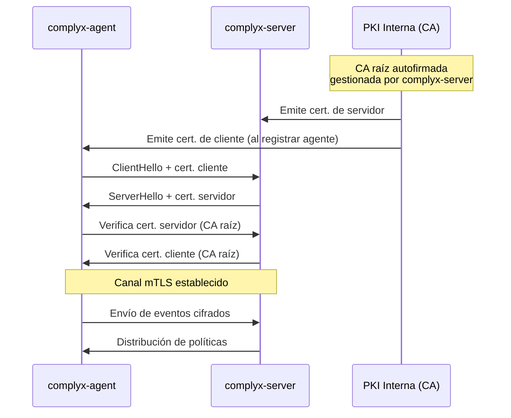

# Comunicación y PKI interna

## Modelo de confianza

Complyx implementa **mTLS obligatorio** entre el agente y el servidor. Esto garantiza que:

1. El agente verifica la identidad del servidor (evita conexiones a servidores falsos).
2. El servidor verifica la identidad del agente (solo agentes registrados pueden conectarse).

## Ciclo de vida de certificados

| Etapa | Descripción |
|---|---|
| Bootstrap del servidor | Se genera la CA raíz y el certificado de servidor |
| Registro de agente | El servidor emite un certificado de cliente firmado por la CA |
| Revocación | El servidor puede revocar certificados de agentes deshabilitados |
| Rotación | Los certificados se renuevan automáticamente antes de su expiración |
