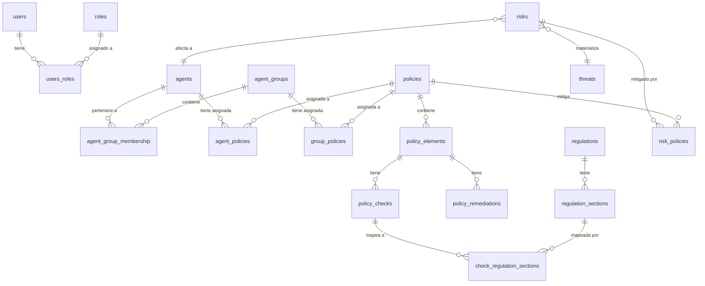
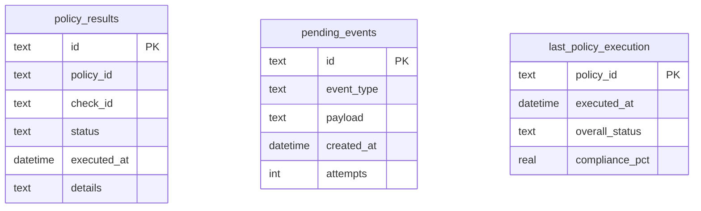

# Modelo entidad-relación

## ERD — Base de datos del servidor

```mermaid
erDiagram
    users ||--o{ users_roles : "tiene"
    roles ||--o{ users_roles : "asignado a"

    agents ||--o{ agent_group_membership : "pertenece a"
    agent_groups ||--o{ agent_group_membership : "contiene"

    agents ||--o{ agent_policies : "tiene asignada"
    policies ||--o{ agent_policies : "asignada a"

    agent_groups ||--o{ group_policies : "tiene asignada"
    policies ||--o{ group_policies : "asignada a"

    policies ||--o{ policy_elements : "contiene"
    policy_elements ||--o{ policy_checks : "tiene"
    policy_elements ||--o{ policy_remediations : "tiene"

    policy_checks ||--o{ check_regulation_sections : "mapea a"
    regulation_sections ||--o{ check_regulation_sections : "mapeada por"
    regulations ||--o{ regulation_sections : "tiene"

    risks }o--|| threats : "materializa"
    risks }o--|| agents : "afecta a"
    risks ||--o{ risk_policies : "mitigado por"
    policies ||--o{ risk_policies : "mitiga"
```

## ERD — Base de datos del agente

```mermaid
erDiagram
    policy_results {
        text id PK
        text policy_id
        text check_id
        text status
        datetime executed_at
        text details
    }

    pending_events {
        text id PK
        text event_type
        text payload
        datetime created_at
        int attempts
    }

    last_policy_execution {
        text policy_id PK
        datetime executed_at
        text overall_status
        real compliance_pct
    }
```
