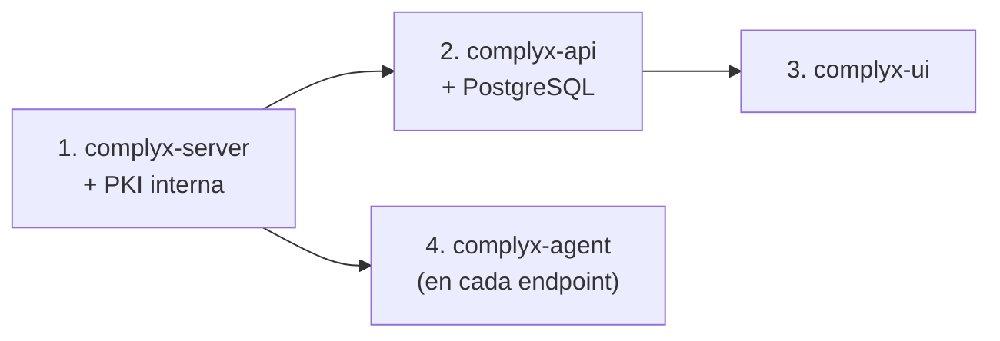

# Primeros pasos

Esta sección te guía desde los requisitos previos hasta tener Complyx completamente operativo en tu entorno.

-   :material-clipboard-list:{ .lg .middle } **[Requisitos del sistema](requirements.md)**

    Comprueba hardware, SO y dependencias antes de instalar.

-   :material-download:{ .lg .middle } **[Instalación](installation.md)**

    Instrucciones paso a paso para cada componente.

-   :material-rocket-launch:{ .lg .middle } **[Configuración rápida](quickstart.md)**

    Levanta un entorno funcional en pocos minutos.

-   :material-docker:{ .lg .middle } **[Despliegue con Docker](docker.md)**

    Despliegue completo usando Docker Compose.

## Orden de despliegue recomendado

!!! tip "Entorno de desarrollo"
    Para desarrollo local, consulta la [guía de entorno de desarrollo](../development/dev-environment.md) con Docker Compose completo.
