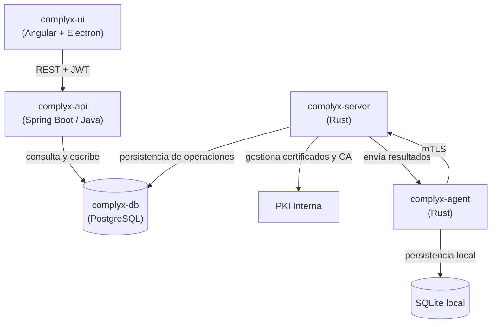

# Complyx

**Plataforma integral de gestión de riesgos y cumplimiento normativo para endpoints Linux y Windows.**

-   :material-shield-check:{ .lg .middle } **Cumplimiento automatizado**

    ---

    Supervisa y audita políticas de seguridad en endpoints, generando evidencias verificables para ISO 27001, ENS y NIS2.

    [:octicons-arrow-right-24: Primeros pasos](getting-started/index.md)

-   :material-robot:{ .lg .middle } **Agentes distribuidos**

    ---

    Agentes escritos en Rust desplegados en endpoints Linux y Windows con comunicación mTLS y motor de políticas JSON firmadas.

    [:octicons-arrow-right-24: complyx-agent](modules/complyx-agent/index.md)

-   :material-server:{ .lg .middle } **Servidor de orquestación**

    ---

    Backend híbrido (Java/Spring Boot + Rust) con PKI interna, gestión de grupos y distribución centralizada de políticas.

    [:octicons-arrow-right-24: complyx-server](modules/complyx-server/index.md)

-   :material-api:{ .lg .middle } **API REST segura**

    ---

    API construida con Spring Boot, autenticación JWT con RBAC (Administrador, Técnico, Auditor) y documentación OpenAPI.

    [:octicons-arrow-right-24: complyx-api](modules/complyx-api/index.md)

-   :material-monitor-dashboard:{ .lg .middle } **Interfaz web moderna**

    ---

    PWA Angular + Electron con dashboard de métricas, matriz de riesgos interactiva y generación de informes de auditoría.

    [:octicons-arrow-right-24: complyx-ui](modules/complyx-ui/index.md)

-   :material-database:{ .lg .middle } **Modelo de datos dual**

    ---

    PostgreSQL en el servidor para persistencia central y SQLite en el agente para operación desconectada y resiliencia.

    [:octicons-arrow-right-24: Base de datos](database/index.md)

---

## ¿Qué es Complyx?

Complyx es una plataforma centralizada diseñada para que las organizaciones del sector TIC **automaticen la gestión de riesgos y el cumplimiento normativo** en sus infraestructuras tecnológicas. A través de una arquitectura de agentes distribuidos, Complyx permite:

- **Verificar configuraciones seguras** en endpoints Linux y Windows de forma continua.
- **Detectar desviaciones** respecto a políticas definidas y generar alertas automáticas.
- **Producir evidencias trazables** para auditorías internas y externas.
- **Alinearse con marcos normativos** como ISO/IEC 27001, ENS y la Directiva NIS2.
- **Visualizar métricas clave** e identificar vulnerabilidades para priorizar acciones correctivas.

## Arquitectura de alto nivel

## Componentes principales

| Repositorio | Tecnología | Función |
|---|---|---|
| [complyx-agent](https://github.com/styxiner/complyx-agent) | Rust | Agente multiplataforma para endpoints |
| [complyx-server](https://github.com/styxiner/complyx-server) | Rust | Servidor de orquestación y PKI interna |
| [complyx-api](https://github.com/styxiner/complyx-api) | Java / Spring Boot | API REST con autenticación JWT |
| [complyx-ui](https://github.com/styxiner/complyx-ui) | Angular / Electron | Interfaz gráfica PWA de escritorio |
| [complyx](https://github.com/styxiner/complyx) | — | Repositorio raíz / monorepo y documentación |

## Marco normativo soportado

!!! info "ISO/IEC 27001:2022"
    Controles de seguridad de la información, incluyendo la medida 8.28 y gestión de vulnerabilidades técnicas.

!!! info "ENS — Esquema Nacional de Seguridad"
    Cumplimiento específico para el sector público español con medidas de seguridad categorizadas.

!!! info "Directiva NIS2"
    Obligaciones de ciberseguridad para operadores de servicios esenciales e importantes en la UE.

---

*Proyecto desarrollado por [@styxiner](https://github.com/styxiner),[@KarlaBasurto](https://github.com/KarlaBasurto)*
