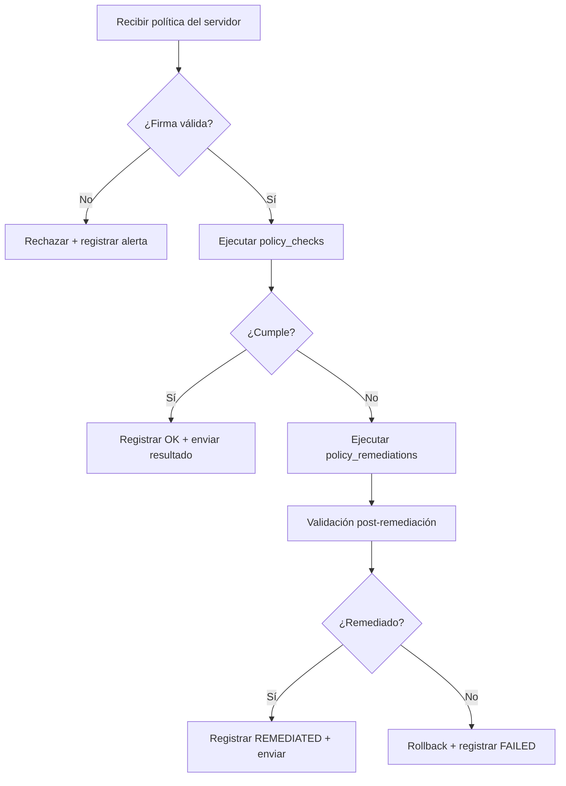

# Motor de políticas

El motor de políticas del agente es responsable de cargar, verificar y ejecutar las políticas JSON distribuidas por el servidor.

## Formato de política JSON

```json
{
  "id": "550e8400-e29b-41d4-a716-446655440000",
  "name": "SSH Hardening v1.2",
  "version": "1.2",
  "severity": "high",
  "signature": "<firma-base64>",
  "elements": [
    {
      "id": "elem-001",
      "name": "PermitRootLogin deshabilitado",
      "checks": [
        {
          "id": "chk-001",
          "name": "Verificar PermitRootLogin",
          "rationale": "Evitar acceso root directo por SSH",
          "check_command": "grep -E '^PermitRootLogin no' /etc/ssh/sshd_config"
        }
      ],
      "remediations": [
        {
          "id": "rem-001",
          "name": "Deshabilitar PermitRootLogin",
          "remediation_command": "sed -i 's/^#*PermitRootLogin.*/PermitRootLogin no/' /etc/ssh/sshd_config"
        }
      ]
    }
  ]
}
```

## Verificación de firma

Antes de ejecutar cualquier política, el agente verifica la firma criptográfica usando la clave pública del servidor. Una política con firma inválida es **rechazada y registrada como evento de seguridad**.

!!! warning "Seguridad"
    El agente nunca ejecuta una política cuya firma no haya sido verificada correctamente. Esto protege contra políticas maliciosas inyectadas por un tercero.

## Ciclo de ejecución


