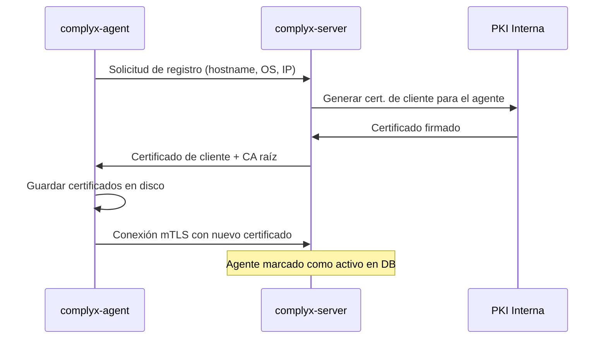

# Orquestación de agentes

El servidor mantiene una conexión persistente mTLS con cada agente registrado.

## Registro de un nuevo agente

## Estados de un agente

| Estado | Descripción |
|---|---|
| `active` | Agente conectado y operativo |
| `inactive` | Agente sin conexión reciente (> `timeout` configurado) |
| `disabled` | Deshabilitado manualmente por un administrador |

## Gestión de la conexión

El servidor detecta agentes desconectados mediante heartbeats periódicos. Si un agente no responde en el tiempo configurado, se marca como `inactive` y se genera un evento de alerta.
