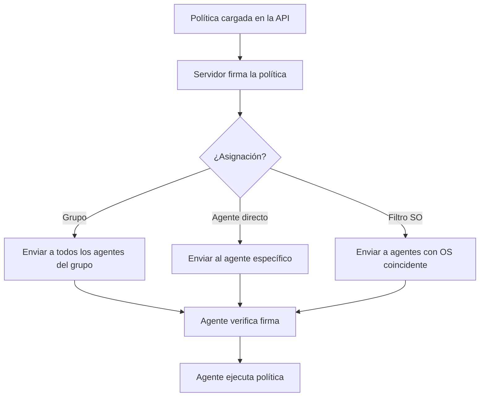

# Distribución de políticas

## Flujo de distribución

## Firma de políticas

Las políticas se firman con la clave privada del servidor antes de distribuirse. El agente verifica la firma usando la clave pública del servidor (incluida en su certificado). Esto garantiza la integridad y autenticidad de toda política ejecutada.
