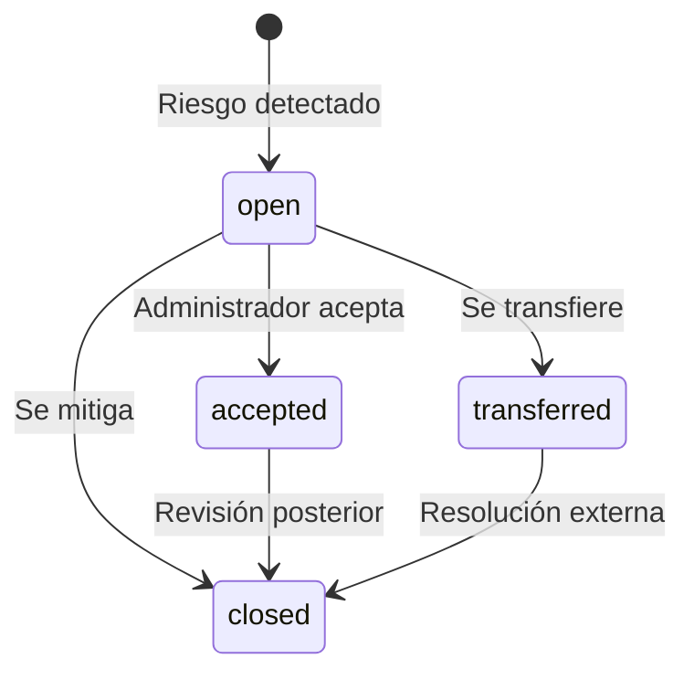

# Gestión de riesgos

Complyx implementa un modelo de gestión de riesgos basado en **amenaza × agente**.

## Cálculo del nivel de riesgo

```
nivel_riesgo = impacto × probabilidad

Donde:
  impacto      ∈ [0, 10]
  probabilidad ∈ [0, 10]
  nivel        ∈ { low, medium, high, critical }
```

| Rango | Nivel |
|---|---|
| 0 – 2.9 | `low` |
| 3 – 5.9 | `medium` |
| 6 – 7.9 | `high` |
| 8 – 10 | `critical` |

## Ciclo de vida de un riesgo


